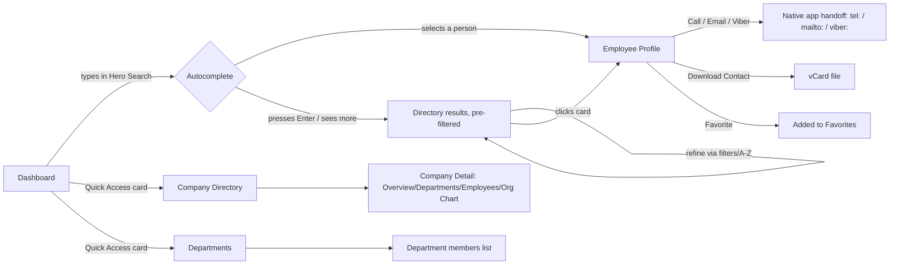
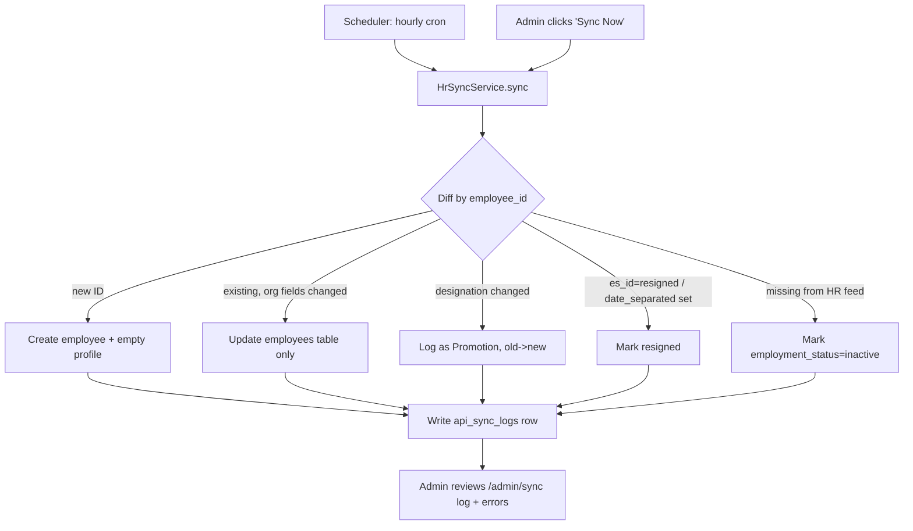

# One Cherry Employee Directory — Architecture & Product Plan

**Status:** Pre-implementation analysis
**Author:** Architecture planning pass (no code generated yet)
**Scope:** Application architecture, database schema, navigation, feature breakdown, wireframe descriptions, and recommendations

> Note: No screenshot was actually attached to the request (the project folder is empty). This plan is based entirely on the written functional spec, which is detailed enough to proceed. If you still want to share the reference screenshot, I'll fold in any functional details it adds.

---

## 1. Guiding Principles

1. **This is a directory, not a system of record.** The HR system owns employment truth (ID, name, company, department, designation, email). One Cherry Employee Directory (OCED) only *extends* that record with contact/social/visual data and *presents* it beautifully. Every architectural decision should protect this boundary — don't let directory-only fields silently become "the truth" for org data.
2. **Speed to find a person beats everything else.** Every screen should answer "who is this, how do I reach them" in under two clicks. Dashboard widgets, filters, and search are the product — not charts or admin tooling.
3. **One database, many companies.** This is *not* multi-tenant SaaS. It's one internal org (One Cherry Group) with `companies` as a first-class dimension, not a tenant boundary. Data isolation between companies is a filter/UX concern, not a security-partition concern (with one exception noted in §9).
4. **Premium, quiet UI.** Generous whitespace, restrained color (brand red used sparingly as accent/action color, not backgrounds), consistent 10–14px radii, soft shadows, 200ms transitions — Apple/Notion/Linear register, not enterprise-SaaS-dashboard register.

---

## 2. Overall Application Architecture

### 2.1 Stack decisions

| Layer | Choice | Rationale |
|---|---|---|
| Backend framework | Laravel 12 | as specified |
| Reactive UI | Livewire 4 + Alpine.js | as specified; Livewire 4 ships Alpine natively, so no separate Alpine install needed |
| Database | MySQL 8 | as specified; utf8mb4, InnoDB, full-text indexes |
| CSS | **Tailwind CSS**, not Bootstrap | You left this open. Bootstrap's component-driven defaults fight against a bespoke Apple/Notion/Linear look — you'd spend most of your time overriding `.card`, `.btn`, `.badge`. Tailwind + a small custom design-token layer (CSS variables for the brand palette, radii, shadows) gets you there faster and makes dark mode trivial (`dark:` variants driven by a CSS var strategy). Recommend confirming before build starts. |
| Icons | Font Awesome (Pro if available, else Free+Duotone) | as specified |
| Search | MySQL full-text for MVP; **Laravel Scout + Meilisearch** as a fast-follow | LIKE-based search will not deliver the "Spotlight-style" autocomplete feel you're describing at thousands of records. Meilisearch is self-hostable, typo-tolerant, sub-50ms. Design the `SearchService` behind an interface so swapping the driver later is a config change, not a rewrite. |
| Auth/roles | Laravel built-in auth + **spatie/laravel-permission** | clean Employee/Administrator roles now, granular permissions later (e.g. "Company X admin only") without a schema rewrite |
| Media | **spatie/laravel-medialibrary** | handles photo/logo/banner uploads, automatic thumbnail conversions, and keeps `employee_profiles`/`companies` free of manual path-juggling |
| Audit | **owen-it/laravel-auditing** (or spatie/laravel-activitylog) | matches the `audit_logs` requirement without hand-rolling diff logic |
| Queue/cache | Redis (fallback: database driver) | image processing, vCard/QR generation, HR sync jobs, dashboard stat caching |
| API | Laravel Sanctum + API Resources, versioned `/api/v1` | "REST API ready" — built from day one even if the Livewire UI doesn't consume it, since HR sync and a future mobile app will |
| Fonts | Proxima Nova (titles), Mint Sans (body) — **self-hosted** | `.woff2` files in `public/fonts/` (`ProximaNova-Regular/Bold`, `MintSans-Regular/Medium`), loaded via `@font-face` in the Tailwind CSS entry with a system-font fallback stack while files load (`font-display: swap`). No third-party font-loader dependency, no external network call at runtime. |

### 2.2 Layered architecture

```
Browser (Livewire/Alpine components, Tailwind)
        │
        ▼
Livewire Components  ──────────────┐
        │                          │
        ▼                          ▼
   Service Layer  ◄────────  API Controllers (app/Http/Controllers/Api)
   (app/Services)                  │
        │                          │
        ▼                          ▼
Repository Layer (app/Repositories, interfaces in Contracts/)
        │
        ▼
Eloquent Models ──► MySQL
        │
        ▼
   Jobs/Queue (sync, image processing, vCard/QR generation)
```

- **API-first is enforced structurally, not by convention.** Livewire components and API controllers both call the Service layer and *only* the Service layer — neither talks to a Repository or Eloquent model directly. A Livewire component is just a thin view-state wrapper around the same service method an API controller calls. This is what makes "REST API ready" actually true rather than aspirational: exposing `/api/v1/employees` later is wiring a controller to an existing `EmployeeDirectoryService` method, not extracting business logic out of a Livewire component after the fact.
- **Repositories** exist per aggregate root (`EmployeeRepository`, `CompanyRepository`, `DepartmentRepository`, `DesignationRepository`, `OfficeLocationRepository`) and encapsulate query complexity (filters, sorting, eager-loading) behind interfaces bound in a `RepositoryServiceProvider`.
- **Services** own business logic and orchestration: `EmployeeDirectoryService`, `EmployeeProfileService`, `SearchService`, `FavoriteService`, `HrSyncService`, `VCardService`, `QrCodeService`, `AuditService`.
- **External integrations plug in as interface-bound adapters, not hardcoded clients.** `HrSyncService` depends on `HrSourceInterface` (§2.4); the same pattern applies to whatever comes next — `DirectorySourceInterface` for Active Directory/Microsoft Graph (group membership, presence, SSO), `IdentitySourceInterface` for Google Workspace or Azure AD login. Each new integration is a new class implementing an existing interface plus a config binding — the Service layer, Livewire components, and API controllers that consume it never change.
- **Jobs**: `SyncEmployeesFromHrJob`, `ProcessEmployeePhotoJob`, `GenerateEmployeeQrCodeJob` — anything slow or third-party-dependent goes async so the UI never blocks.

### 2.3 Folder structure (high level)

```
app/
  Http/
    Controllers/Api/V1/          # thin, REST-ready
    Livewire/
      Dashboard/
      Directory/                # EmployeeList, EmployeeCard, Filters, AlphabetFilter
      Profile/                  # EmployeeProfile, VCardDownload, QrCode
      Companies/                # CompanyDirectory, CompanyDetail, OrgChart
      Departments/
      Admin/
        Employees/ Companies/ Departments/ Designations/ OfficeLocations/
        Sync/ Settings/ AuditLogs/
      Shared/                   # SearchBar, Toast, EmptyState, SkeletonLoader
  Models/
  Repositories/
    Contracts/
    Eloquent/
  Services/
  Jobs/
  Policies/
  Enums/                        # EmploymentStatus, SyncStatus, AuditAction
  DTOs/                         # HrEmployeePayload, SyncResult
resources/
  views/livewire/...
  css/ (tailwind entry + design tokens)
routes/
  web.php  api.php  console.php (scheduler)
database/
  migrations/ factories/ seeders/
```

### 2.4 HR sync direction — **confirmed: pull model**

```
HR System → REST API → Laravel Scheduler → Sync Service → Employee Directory Database
```

OCED pulls. The scheduler (hourly, or nightly if change volume is low — configurable, not hardcoded) invokes `HrSyncService::sync()`, which calls the HR system's REST API, diffs by `employee_id` (immutable, unique key), and writes only to the HR-controlled columns (§3.2). No inbound webhook, no changes required on the HR side, no attack surface added. The same service is reused by a manual "Sync Now" button in `/admin/sync` — one code path, two triggers.

**Actual HR table (confirmed from the live schema)** is a combined user+employee record:
`id, first_name, middle_name, last_name, email, username, password, employee_code, date_hired, date_regular, date_separated, location, es_id, is_id, fr_id, job_level, ug_id, r_id, c_id, d_id, u_enabled, u_active, remember_token, ..., first_login, force_rate`

| HR column | Meaning | OCED treatment |
|---|---|---|
| `employee_code` | business employee ID | **sync key** → `employees.employee_id` (immutable, matches the original "Employee ID as unique key" requirement) |
| `first_name`, `middle_name`, `last_name` | name parts | synced → `employees.*`, HR-controlled |
| `email` | corporate email | synced → `employees.email`, HR-controlled |
| `c_id` | company | synced → `employees.company_id`, resolved via a `companies.hr_ref_id` mapping column |
| `ug_id` | **user group = Department** in this org's convention | synced → `employees.department_id`, resolved via a `departments.hr_ref_id` mapping column |
| `d_id` | designation | synced → `employees.designation_id`, resolved via a `designations.hr_ref_id` mapping column — this is the field that changes on a **promotion** |
| `is_id` | immediate supervisor's HR id | synced → `employees.immediate_supervisor_id`, resolved by matching the referenced record's `employee_code` |
| `es_id` | employment status id | synced → `employees.employment_status`, translated via a small config-driven map (`config/hr_sync.php`), not a DB table — the status list is short and stable |
| `date_hired` | hire date | synced → `employees.date_hired` |
| `date_regular` | regularization date | synced → `employees.date_regularized` (stored, shown in Organization Information as a nice-to-have; not required) |
| `date_separated` | separation date | synced → `employees.date_separated`; non-null is a second signal (alongside `es_id`) that an employee should be resigned/inactive |
| `job_level` | numeric level | synced → `employees.job_level`, **stored but not displayed** anywhere in v1 UI — reserved for future use |
| `location` | plain text site name | **ignored.** Office Location is fully OCED/Admin-owned (and eventually employee-supplied) — no attempt to map or sync it |
| `fr_id` | unclear/unused | **ignored** for now — not synced, not mapped |
| `username`, `password`, `remember_token`, `ug_id`'s sibling `r_id`, `u_enabled`, `first_login`, `force_rate` | HR app's own login/session/permission plumbing | **ignored entirely** — irrelevant to OCED, which has its own `users` table and RBAC |

**Never touched by sync (directory/employee-supplied, present or future):** Profile Picture, Mobile, Viber, Telephone Extension, Personal Email, About Me, Skills, LinkedIn, Facebook, Emergency Contact, Office Seat/Desk, Pronunciation, Favorite Contacts, Office Location, Suffix, Nickname, Gender, Birthday — none of these exist in HR's table at all, so there's no risk of sync ever overwriting them.

**Scope of what the sync actually needs to detect**, per your framing: new hires, resignations, and promotions (designation changes) are the three cases that matter operationally. The sync still diffs *all* HR-controlled fields generically (company/department/supervisor changes included) since that's the same cost as diffing one field — but promotion-via-`d_id`-change and resignation-via-`es_id`/`date_separated` are the flagship logged events.

**Identity vs. metadata pattern for Companies/Departments/Designations:** all three are partially HR-driven (their *existence* and *name* come from HR's `c_id`/`ug_id`/`d_id`) but also carry OCED-only descriptive data (logo, color theme, description, department head, hierarchy level). Rule: sync **auto-provisions** a record (via `hr_ref_id`) the first time it sees a new HR id, syncing only `name`; everything else (logo/description/address/head/hierarchy_level) is Admin-curated and never touched by sync. If sync sees an HR id it can't map, it creates a stub (`"Unmapped Department #<id>"`) and flags it in `api_sync_logs` for an Admin to fill in — sync never blocks on this.

To keep this swappable (and ready for Active Directory / Google Workspace / Microsoft Graph later, per your API-first direction below), the sync service depends on an interface, not a concrete HTTP client:

```
interface HrSourceInterface {
    public function fetchEmployees(): Collection; // returns HrEmployeeData DTOs
}
```

`HrSyncService` takes an `HrSourceInterface` via constructor injection. Today's binding is `HrRestApiSource`. A future AD/Graph sync for presence or SSO becomes a second adapter (`MicrosoftGraphSource implements DirectorySourceInterface`) plugged in beside it — not a rewrite of the sync engine.

---

## 3. Database Schema

### 3.1 ERD

```mermaid
erDiagram
    COMPANIES ||--o{ DEPARTMENTS : has
    COMPANIES ||--o{ DESIGNATIONS : has
    COMPANIES ||--o{ OFFICE_LOCATIONS : has
    COMPANIES ||--o{ EMPLOYEES : employs
    DEPARTMENTS ||--o{ EMPLOYEES : contains
    DEPARTMENTS }o--o| EMPLOYEES : "headed by"
    DESIGNATIONS ||--o{ EMPLOYEES : "assigned to"
    OFFICE_LOCATIONS ||--o{ EMPLOYEE_PROFILES : "based at"
    EMPLOYEES ||--o| EMPLOYEE_PROFILES : extends
    EMPLOYEES ||--o{ EMPLOYEES : supervises
    EMPLOYEES ||--o{ EMPLOYEE_FAVORITES : "favorited as"
    EMPLOYEES ||--o{ EMPLOYEE_SKILL : has
    SKILLS ||--o{ EMPLOYEE_SKILL : "used by"
    USERS ||--o{ EMPLOYEE_FAVORITES : favorites
    USERS |o--o| EMPLOYEES : "login linked to"
    USERS ||--o{ AUDIT_LOGS : performs
    USERS ||--o{ API_SYNC_LOGS : triggers

    COMPANIES {
        bigint id PK
        int hr_ref_id UK "nullable, HR's c_id"
        string name "synced (identity), rest is Admin-owned"
        string slug UK
        string logo_path
        text description
        string address
        string phone
        string email
        string website
        string color_theme
        boolean is_active
        timestamp deleted_at
    }
    DEPARTMENTS {
        bigint id PK
        int hr_ref_id UK "nullable, HR's ug_id (user group)"
        bigint company_id FK
        string name "synced (identity), rest is Admin-owned"
        bigint department_head_id FK "nullable, -> employees.id, Admin-owned"
        text description
        boolean is_active
        timestamp deleted_at
    }
    DESIGNATIONS {
        bigint id PK
        int hr_ref_id UK "nullable, HR's d_id"
        bigint company_id FK
        string name "synced (identity), rest is Admin-owned"
        tinyint hierarchy_level "Admin-owned, org-chart grouping"
        text description
        boolean is_active
    }
    OFFICE_LOCATIONS {
        bigint id PK
        bigint company_id FK "nullable, shared locations"
        string name
        string address
        string city
        string country
        string phone
        boolean is_active
    }
    EMPLOYEES {
        bigint id PK
        string employee_id UK "= HR's employee_code, immutable sync key"
        string first_name "HR-controlled"
        string middle_name "HR-controlled"
        string last_name "HR-controlled"
        string email UK "corporate email, HR-controlled"
        bigint company_id FK "HR-controlled, via c_id"
        bigint department_id FK "HR-controlled, via ug_id"
        bigint designation_id FK "HR-controlled, via d_id"
        bigint immediate_supervisor_id FK "nullable, self, HR-controlled via is_id"
        enum employment_status "active/on_leave/resigned/inactive, from es_id"
        date date_hired "HR-controlled"
        date date_regularized "HR-controlled, optional display"
        date date_separated "HR-controlled, nullable"
        tinyint job_level "HR-controlled, stored only, not displayed"
        enum source "hr_sync/manual"
        timestamp last_synced_at
        timestamp deleted_at
    }
    EMPLOYEE_PROFILES {
        bigint id PK
        bigint employee_id FK UK
        string suffix "not in HR, directory-owned"
        string nickname "not in HR, directory-owned"
        string gender "not in HR, directory-owned"
        date birthday "not in HR, directory-owned"
        string name_pronunciation "optional phonetic guide"
        string photo_path
        string cover_banner_path
        string personal_email
        string mobile_number
        string viber_number
        string telephone
        string local_extension
        string office_seat "desk/seat identifier"
        bigint office_location_id FK "fully OCED-managed, not from HR"
        text about_me
        string facebook_url
        string linkedin_url
        string qr_code_path
        string emergency_contact_name
        string emergency_contact_relationship
        string emergency_contact_phone
    }
    SKILLS {
        bigint id PK
        string name UK
    }
    EMPLOYEE_SKILL {
        bigint employee_id FK
        bigint skill_id FK
    }
    EMPLOYEE_FAVORITES {
        bigint id PK
        bigint user_id FK
        bigint employee_id FK
        timestamp created_at
    }
    USERS {
        bigint id PK
        bigint employee_id FK "nullable"
        string name
        string email UK
        string password
        string external_id "nullable, for future SSO"
        string auth_provider "local/azure_ad, default local"
        boolean is_active
        timestamp last_login_at
    }
    API_SYNC_LOGS {
        bigint id PK
        enum sync_type "manual/scheduled"
        timestamp started_at
        timestamp completed_at
        enum status "success/partial/failed"
        int records_imported
        int records_updated
        int records_transferred
        int records_deactivated
        json errors
        bigint triggered_by FK "nullable -> users"
    }
    AUDIT_LOGS {
        bigint id PK
        bigint user_id FK "nullable, system actions"
        string action
        string auditable_type
        bigint auditable_id
        json old_values
        json new_values
        string ip_address
        string user_agent
        timestamp created_at
    }
```

### 3.2 Design notes on the schema

- **`employees` vs `employee_profiles` split is deliberate and load-bearing.** `employees` mirrors what HR sync can overwrite (identity + org placement). `employee_profiles` is directory-owned and must **never** be touched by the sync job. This is what makes "HR remains source of truth" actually true at the code level, not just in a doc.
- **No name-parsing problem.** HR's table already stores `first_name`/`middle_name`/`last_name` as discrete columns, so there's no fuzzy parsing or "manually corrected then re-clobbered by sync" risk to design around. `suffix` and `nickname` aren't in HR at all, so they live in `employee_profiles` as directory-owned fields with no sync interaction whatsoever.
- **No `is_active` boolean.** Directory visibility is derived purely from `employment_status` via a query scope (`scopeVisibleInDirectory(): whereIn('employment_status', ['active','on_leave'])`), not a separately-maintained flag — with a stable 4-value enum (`active/on_leave/resigned/inactive`) driven straight from HR's `es_id` (and cross-checked against `date_separated`), a second boolean would just be a second place for status to drift out of sync with itself.
- **`department_head_id` and `immediate_supervisor_id` both point at `employees.id`**, not `employee_profiles`, and both are nullable self-referencing FKs — needed for the org chart and "Reporting Manager / Team Members" profile section.
- **Skills as a normalized `skills` + `employee_skill` pivot**, not a JSON column — this is the one place I deviate from "just match the spec." It costs one more table but buys you skill-based search/filter later ("find everyone who knows Figma") essentially for free. If skills will only ever be freeform display text, a JSON column is fine — flag your intent and I'll adjust.
- **Recently Viewed is intentionally *not* a MySQL table.** High-write, low-value-to-persist-forever data like "employee X viewed employee Y at 3:41pm" is a poor fit for a relational table at scale (thousands of employees × frequent browsing = huge write volume for data nobody queries historically). Recommend a Redis sorted-set per user (`recently_viewed:{user_id}`, capped at last 10, TTL optional) instead. If Redis isn't available in your infra, a lightweight `employee_views` table with a scheduled prune job is the fallback.
- **`api_sync_logs` and `audit_logs` are append-only** — no updates, no soft deletes, no FKs that would block insert-on-failure (e.g. `triggered_by` nullable so system-run scheduled syncs still log cleanly).
- **Indexes**: unique on `employees.employee_id` and `.email`; unique nullable on `companies.hr_ref_id`, `departments.hr_ref_id`, `designations.hr_ref_id` (the sync's lookup keys); composite `(company_id, department_id)`, index on `employment_status`; full-text index on `(first_name, last_name)` plus `email` for the hero search; index `employee_profiles.mobile_number`/`viber_number` if you commit to phone-number search (spec says "search by mobile number").
- **Soft deletes** on `employees`, `companies`, `departments`, `designations`, `office_locations` — an admin "delete" should almost never be a hard delete in a directory people depend on; pair with audit logs for recovery.

---

## 4. Navigation Flow

### 4.1 Site map

```
/                          → Dashboard (People Hub)          [Employee, Admin]
/search                    → Global search results            [Employee, Admin]
/directory                 → Employee Directory (grid/list)   [Employee, Admin]
/directory/{employee}      → Employee Profile                 [Employee, Admin]
/companies                 → Company Directory                [Employee, Admin]
/companies/{company}       → Company Detail (tabs)            [Employee, Admin]
/departments                → Departments list                 [Employee, Admin]
/departments/{department}  → Department members                [Employee, Admin]
/favorites                 → My Favorites                      [Employee, Admin]
/profile                   → My Profile                        [Employee, Admin]

/admin                      → Admin Dashboard                  [Admin only]
/admin/employees            → Employee CRUD                    [Admin]
/admin/companies            → Company CRUD                     [Admin]
/admin/departments          → Department CRUD                  [Admin]
/admin/designations         → Designation CRUD                 [Admin]
/admin/office-locations     → Office Location CRUD             [Admin]
/admin/sync                 → HR Sync dashboard + logs         [Admin]
/admin/settings              → App settings/branding            [Admin]
/admin/audit-logs           → Audit log viewer                 [Admin]

/api/v1/...                 → REST endpoints (Sanctum-auth)    [future clients]
```

### 4.2 Primary user flow — "find a colleague"



### 4.3 Admin flow — "sync stays healthy"



---

## 5. Feature Breakdown

### 5.1 By role

| Capability | Employee | Administrator |
|---|---|---|
| Search/browse employees, companies, departments | ✅ | ✅ |
| View full employee profile, org chart, reporting lines | ✅ | ✅ |
| Favorite employees, view recently viewed | ✅ | ✅ |
| Download vCard, view QR code | ✅ | ✅ |
| Edit own optional profile fields (photo, about me, skills, socials) — *see open question in §9* | ✅ (self only) | ✅ (self + any) |
| Create/edit/delete Employees, Companies, Departments, Designations, Office Locations | ❌ | ✅ |
| Trigger/monitor HR sync, view sync logs | ❌ | ✅ |
| View audit logs | ❌ | ✅ |
| Manage app settings/branding | ❌ | ✅ |

### 5.2 By module

- **Dashboard (People Hub):** hero search w/ autocomplete, 4 stat cards (Employees/Companies/Departments/Office Locations), Quick Access cards (Directory/Companies/Departments/My Profile), Recently Viewed, Favorites, Birthday Celebrants (horizontal scroll), New Employees (last 30 days), optional Announcements panel.
- **Employee Directory:** sticky filter bar (search, company, department, designation, office, employment status), A–Z rail, grid/list toggle, sort (newest/name/department/company), employee cards with quick actions (View/Call/Email/Viber/Favorite), skeleton loaders, empty state.
- **Employee Profile:** cover banner + avatar, status badge, tabs/sections (Personal, Contact, Organization, Emergency Contact, Skills, About, Reporting Manager, Team Members), QR code, vCard download.
- **Company Directory & Detail:** company cards (logo, name, headcount, address, phone, email, website), detail tabs (Overview/Departments/Employees/Org Chart).
- **Departments:** list with head + headcount, member drill-down.
- **Admin Panel:** sidebar nav, dashboard, full CRUD for the five master entities, Sync module (manual trigger + history + error surfacing), Settings, Audit Logs.
- **HR Sync module:** import/update/transfer-detection/auto-resign, manual + scheduled execution, structured logging.
- **Cross-cutting:** RBAC (Spatie), toast notifications, skeleton loaders, empty states, dark-mode-ready tokens, responsive mobile-first layout, REST API v1.

---

## 6. UI Wireframe Descriptions

Textual layout specs — visual mockups (Artifact/HTML) are a good next step once you confirm direction, but per your instruction no code/visuals yet.

### 6.1 Dashboard

```
┌────────────────────────────────────────────────────────────┐
│  Top bar: logo · global nav · dark-mode toggle · avatar     │
├────────────────────────────────────────────────────────────┤
│                                                              │
│         "Search employee by name, email, mobile,            │
│          department or company..."   [ ⌕ ─────────── ]     │  ← Hero search,
│              live dropdown: grouped People / Companies /     │    autocomplete
│              Departments results as you type                │
│                                                              │
├───────────────┬───────────────┬───────────────┬─────────────┤
│  1,284         │  6             │  42            │  11         │  ← 4 stat cards,
│  Employees     │  Companies     │  Departments   │  Offices    │    icon + number +
│                │                │                │             │    label, subtle
└───────────────┴───────────────┴───────────────┴─────────────┘    hover lift

┌─── Quick Access ─────────────────────────────────────────────┐
│  [Directory]  [Companies]  [Departments]  [My Profile]        │  ← 4 large tap
└────────────────────────────────────────────────────────────┘    targets, icon-led

┌─ Birthday Celebrants ──────────────────────────► scroll ─────┐
│ (photo) Name / Dept / "Jul 26"   (photo) Name / Dept / "Jul 28" ...
└────────────────────────────────────────────────────────────┘

┌─ New Employees (30 days) ──────┐  ┌─ Recently Viewed ─────────┐
│ card list, "Joined 5 days ago" │  │ small avatar row           │
└─────────────────────────────────┘  └─────────────────────────┘

┌─ Favorites ─────────┐  ┌─ Announcements (optional) ───────────┐
│ pinned people        │  │ HR notices, dismissible               │
└─────────────────────┘  └────────────────────────────────────┘
```

### 6.2 Employee Directory

```
┌ Sticky filter bar ─────────────────────────────────────────┐
│ [Search......] [Company ▾][Dept ▾][Designation ▾][Office ▾] │
│ [Status ▾]                          [Sort ▾]  [▦ Grid|☰ List]│
│ A B C D E F G H I J K L M N O P Q R S T U V W X Y Z          │  ← alphabet rail
├──────────────────────────────────────────────────────────────┤
│  ┌────────────┐  ┌────────────┐  ┌────────────┐              │
│  │  [photo]   │  │  [photo]   │  │  [photo]   │   grid cards,│
│  │  Name       │  │  Name       │  │  Name       │   3–4/row  │
│  │  Designation│  │  Designation│  │  Designation│   desktop, │
│  │  Dept·Company│ │  Dept·Company│ │  Dept·Company│   1/row   │
│  │  email·mobile│ │  email·mobile│ │  email·mobile│   mobile  │
│  │ [View][Call][Mail][Viber][♥]│ ...                          │
│  └────────────┘  └────────────┘  └────────────┘              │
│  hover: card lifts 4px, shadow deepens, 200ms ease            │
└──────────────────────────────────────────────────────────────┘
```

### 6.3 Employee Profile

```
┌ Cover banner (company color_theme or default gradient) ─────┐
│              [Large avatar, overlapping banner]              │
│              Name · Designation                              │
│              Department · Company        [● Status badge]    │
│              [Call][Email][Viber][Favorite][Download vCard]  │
├───────────────────────────────┬──────────────────────────────┤
│ Personal Information           │  QR Code (share/scan contact) │
│ Contact Information            │                                │
│ Organization Information       │  Reporting Manager (card)     │
│ Emergency Contact (optional)   │  Team Members (avatar list)   │
│ Skills (chips)                 │                                │
│ About                          │                                │
└───────────────────────────────┴──────────────────────────────┘
```

### 6.4 Company Directory & Detail

```
Company Directory: grid of cards — [logo] Name · N employees · address ·
phone/email/website · [View Company →]

Company Detail:
┌ Tabs: Overview | Departments | Employees | Org Chart ─────────┐
│ Overview: banner w/ company color_theme, description, contact  │
│ Departments: list w/ head + count → drill into members         │
│ Employees: same card grid as Directory, pre-filtered by company│
│ Org Chart: collapsible tree, supervisor → reports              │
└─────────────────────────────────────────────────────────────┘
```

### 6.5 Admin panel shell

```
┌ Sidebar (collapsible) ─┬ Content ─────────────────────────────┐
│ Dashboard               │  Data table: search, column filters, │
│ Employees                │  bulk actions, pagination            │
│ Companies                │  Row actions: Edit / Deactivate /    │
│ Departments               │  View Audit Trail                    │
│ Designations              │                                       │
│ Office Locations          │  Forms: sectioned (Personal/Contact/ │
│ API Sync                  │  Organization/Additional) w/ inline  │
│ Settings                  │  validation, autosave draft optional │
│ Audit Logs                │                                       │
└──────────────────────────┴──────────────────────────────────────┘
```

---

## 7. HR Sync Architecture (confirmed design — see §2.4 for the full field mapping)

```
HrSyncService::sync()
  1. Fetch employee payload set from HrSourceInterface (REST API pull, paginated)
  2. Resolve each payload's c_id / ug_id / d_id to companies/departments/designations.id
       via hr_ref_id lookup; unmapped id → auto-create a named stub record, log a warning
  3. Match employee on employee_code = employees.employee_id
       not found in OCED         → create employees row (source=hr_sync) + empty employee_profiles row  [NEW HIRE]
       found, d_id changed        → update designation_id, log as PROMOTION (old → new)
       found, other synced field  → update in place (name, company, department, supervisor, dates, job_level)
       found, es_id=resigned OR
              date_separated set  → set employment_status=resigned (or inactive per es_id), keep record  [RESIGNATION]
  4. Any employee currently active/on_leave in OCED but absent from the HR feed entirely
       → mark employment_status=inactive (data no longer confirmed by HR) — distinct from an explicit resignation
  5. Write one api_sync_logs row per run: new-hire/promotion/resignation counts + errors (JSON), regardless of outcome
  6. Dispatch as a queued job so a large sync never blocks the "Sync Now" admin request
Fields updated by sync: first_name, middle_name, last_name, email, company_id, department_id,
  designation_id, immediate_supervisor_id, employment_status, date_hired, date_regularized,
  date_separated, job_level. Never touched: anything in employee_profiles.
Triggers: Laravel Scheduler (routes/console.php in L12) — hourly by default, configurable to nightly —
          plus a manual "Sync Now" button in /admin/sync calling the exact same service method.
```

---

## 8. Best-Practice Guardrails (Laravel/Livewire specifics)

- Authorize every mutation via **Policies**, not inline role checks in components — keeps Blade/Livewire dumb and testable.
- Use **Form Request / Livewire form objects** for validation, not ad hoc `$this->validate()` scattered in components.
- Wrap multi-table writes (e.g. create employee + profile, or a sync batch) in **DB transactions**.
- **Eager-load** relationships in every repository query used by the directory grid (`company`, `department`, `designation`, `profile.officeLocation`) — this is the single highest-risk N+1 spot given "thousands of employees."
- Cache dashboard stat counts and company/department/designation dropdown lists (rarely change) with tagged cache keys invalidated on the relevant model's `saved`/`deleted` events.
- Debounce Livewire search inputs (`wire:model.live.debounce.300ms`) and paginate directory results server-side; never load the full employee table into a Livewire component's public property.
- All uploaded images processed via a queued job (resize/optimize/convert to WebP) — never block the request cycle on image manipulation.
- Feature-test the Service layer directly (fast, no HTTP/Livewire overhead) and add a thinner layer of Livewire component tests for interaction behavior.

---

## 9. Open Questions

**Resolved this round:**

- ✅ HR sync is pull-based, hourly/nightly via Laravel Scheduler, keyed on `employee_code` (§2.4, §7).
- ✅ Real HR schema confirmed and mapped field-by-field (§2.4) — including that Department = HR's `ug_id` (user group), not a dedicated column.
- ✅ Status model simplified to `active / on_leave / resigned / inactive`, sourced from `es_id` + `date_separated`; no real-time "Online" presence in v1 (future Microsoft Graph presence — Available/Busy/Away/Offline — noted as a v2 hook, not built now).
- ✅ Field ownership matrix confirmed: HR-controlled vs. Employee-editable, including new fields (Office Seat/Desk, Pronunciation) not in the original spec (§2.4, §5).
- ✅ Fonts self-hosted from `public/fonts/` via `@font-face`, no external font service.
- ✅ `job_level` is stored (synced) but not surfaced in any v1 UI; `designations.hierarchy_level` remains the Admin-owned field actually used for org-chart grouping — these two stay decoupled since only the latter was asked to drive display.
- ✅ HR's `location` string and `fr_id` are explicitly ignored by sync — Office Location is entirely OCED-owned/future employee-supplied.

**Still open:**

1. **Designations/Departments scope** — confirmed per-company in the schema (matches HR's `d_id`/`ug_id` being company-specific in practice) — flag if any designation/department is actually meant to be shared *across* companies in the group.
2. **Cross-company visibility** — should any employee see every company's directory by default (current assumption), or are there company-scoped visibility restrictions (e.g. holding company vs. subsidiary)?
3. **Expected scale** — approximate total employee count and concurrent users, to decide whether Meilisearch/Redis are worth standing up at launch vs. added later as a fast-follow.
4. **HR API contract** — endpoint, auth method (API key/OAuth), pagination, and whether it returns readable status labels or only raw `es_id` integers (determines how the `config/hr_sync.php` status map gets built).
5. **Sensitive field visibility** — should Personal Email/Emergency Contact be visible to all employees, or restricted to the employee + their manager + Admin? (§10)

---

## 10. Recommended Improvements Beyond the Spec

- **Profile completeness indicator** on the admin employee list and on `/profile` — nudges data quality (a directory is only as good as how filled-in it is) without adding real complexity. Especially relevant now that most contact fields are entirely employee-supplied.
- **Structured `skills` table** instead of freeform text, enabling "who knows X" search later (§3.2) — low cost now, expensive to retrofit later.
- **Unmapped-record review queue** — since Companies/Departments/Designations can now be auto-stubbed by sync when an unrecognized `c_id`/`ug_id`/`d_id` shows up (§2.4), surface these stubs prominently in `/admin/sync` so they don't quietly sit as "Unmapped Department #14" for months.
- **Meilisearch-backed search** for the hero/autocomplete experience — the difference between "feels premium" and "feels like a form" at the scale you're describing is almost entirely search latency + typo tolerance.
- **Redis-based Recently Viewed** instead of a table — avoids an unbounded write-heavy table with little query value (§3.2).
- **Sensitive-field visibility matrix** — personal email, mobile, Viber, emergency contact are more sensitive than work email; consider whether these should be visible to all employees, or only to the employee themselves + their manager + Admin. Worth deciding deliberately rather than defaulting to "everyone sees everything."
- **Soft delete everywhere in master data** (§3.2) paired with audit logs, so admin mistakes are recoverable, not destructive.
- **`api_sync_logs` surfaced prominently in the admin dashboard**, not buried in a submenu — sync health is the thing most likely to silently degrade and erode trust in the directory ("why isn't the new hire showing up?").

---

## 11. Suggested Next Steps

1. You confirm/answer §9 open questions (or tell me to proceed with the stated defaults).
2. I produce visual mockups (Dashboard, Directory, Profile, Company Directory) as an HTML/Tailwind Artifact so you can react to the actual look before any Laravel code is written — this is the fastest way to align on the "Apple/Notion/Linear, not enterprise-SaaS" feel.
3. Once visual direction is approved, scaffold the Laravel 12 + Livewire 4 project, migrations, and repository/service skeletons per this document.
