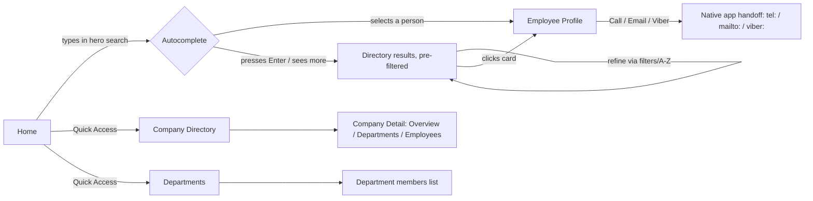
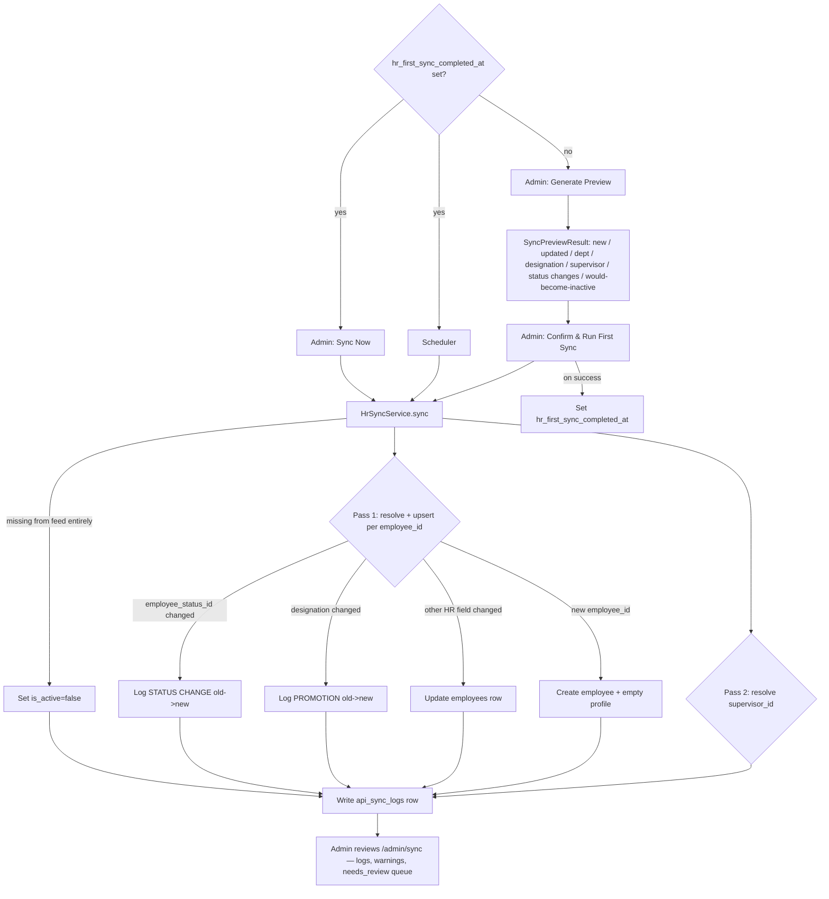

# One Cherry Employee Directory — Architecture & Product Plan

**Status:** Revised architecture — HR-driven directory model (Rev. 2)
**Scope:** Application architecture, database schema, navigation, feature breakdown, wireframe descriptions, HR synchronization, and recommendations
**Supersedes:** the original plan's Employee/Administrator dual-role model, analytics dashboard, and self-service profile features — all removed per the 2026-07-29 business requirements revision.

---

## 1. Guiding Principles

1. **HR is the only source of truth, and sync is not a feature — it's the core of the system.** OCED holds no employment truth of its own. Every field HR's API exposes (identity, org placement, employment status, reporting line, employment dates) is read-only inside OCED and is overwritten by every sync run, without exception. OCED never calculates, infers, or overrides employment status or org structure independently of HR.
2. **This is a directory, not a platform.** OCED runs on the internal company network only. It has one job: help someone find a colleague and their basic contact/org info in under two clicks. Every feature earns its place by directly serving that job — search, browse, view. Nothing else.
3. **No employee accounts, ever.** Only Administrators authenticate. Internal users reach the directory by being on the company network — there is no login wall, no personal dashboard, no self-service, nothing to remember. This removes an entire category of product surface (auth, sessions, password resets, personalization) that a pure directory doesn't need.
4. **Two kinds of data, two owners, one hard boundary.** HR-owned fields (identity, org placement, employment status/dates, supervisor) are always read-only in OCED. Directory-owned fields (photo, about, Viber, telephone/extension, office location, birthday) are the only things an Administrator can ever edit — and sync must never touch them. This boundary is enforced at the schema and service level, not by convention.
5. **One database, many companies.** Still not multi-tenant SaaS — one org (One Cherry Group), `companies` as a dimension, not a tenant/security boundary.
6. **Quiet, fast UI.** Same visual register as before (generous whitespace, restrained brand-red accent, soft shadows) — but the bar for whether a screen exists at all is now "does this help someone find a person," not "would this look good on a dashboard."

---

## 2. Overall Application Architecture

### 2.1 Stack decisions

| Layer | Choice | Rationale / change |
|---|---|---|
| Backend framework | Laravel 12 | unchanged |
| Reactive UI | Livewire 4 + Alpine.js | unchanged |
| Database | MySQL 8 | unchanged |
| CSS | Tailwind CSS | unchanged |
| Icons | Font Awesome | unchanged |
| Search | MySQL full-text for MVP; Meilisearch fast-follow | unchanged — search is now *more* central to the product since Home's entire job is search |
| Auth | Laravel built-in auth, **Administrators only** | Employee login removed entirely (§2.4). `spatie/laravel-permission` is retained even though there is currently only one role (`Administrator`) — it costs nothing to keep and avoids a schema migration the day OCED needs a second admin tier (e.g. a "Sync Operator" who can only view/trigger sync, not edit master data). No `Employee` role exists anywhere in the system going forward. |
| Media | `spatie/laravel-medialibrary` | narrowed scope — profile photos and company logos only. No cover banners, no QR codes. |
| Audit | `owen-it/laravel-auditing` | unchanged — more important now, since it's the only record of who changed a directory-owned field |
| Queue/cache | Redis (fallback: database) | narrowed scope — photo processing and HR sync only. Recently Viewed's Redis usage is gone (feature removed). |
| API | Laravel Sanctum + API Resources, `/api/v1` | unchanged; exists primarily to receive from HR and to keep the door open for a future read-only client, not because the Livewire UI needs it |
| Fonts | self-hosted, unchanged | unchanged |

**Removed from the stack entirely:** anything that existed only to support Favorites, Recently Viewed, vCard/QR generation, or employee self-service (skills tagging, personal profile editing forms, password management, employee-facing settings).

### 2.2 Layered architecture

```
Browser (Livewire/Alpine, Tailwind) — no auth for directory browsing
        │
        ▼
Livewire Components ─────────────────┐
        │                            │
        ▼                            ▼
   Service Layer  ◄────────  API Controllers (app/Http/Controllers/Api)
   (app/Services)                    │
        │                            │
        ▼                            ▼
Repository Layer (interfaces in Contracts/)
        │
        ▼
Eloquent Models ──► MySQL
        │
        ▼
   Jobs/Queue (HrSyncJob, photo processing)
```

- Same "Livewire and API controllers both call the Service layer only" rule as before — unchanged, still the mechanism that keeps the app API-first.
- **Services, updated roster:** `EmployeeDirectoryService`, `SearchService`, `HrSyncService`, `AuditService`. **Removed:** `EmployeeProfileService` (self-service editing is gone — profile *display* stays in `EmployeeDirectoryService`; the narrow directory-owned-field edit form is an Admin-only concern, folded into the Admin Employees module), `FavoriteService`, `VCardService`, `QrCodeService`.
- **`HrSyncService` is the most important service in the application** — everything else is secondary to keeping it correct and observable.
- External integrations still plug in as interface-bound adapters (`HrSourceInterface` today; `DirectorySourceInterface`/`IdentitySourceInterface` for AD/Graph/Google Workspace later — unchanged principle from the original plan, restated in §11).

### 2.3 Folder structure (high level, updated)

```
app/
  Http/
    Controllers/Api/V1/
    Livewire/
      Public/                    # unauthenticated, network-restricted
        Home                     # replaces "Dashboard" for internal users
        Directory/                # EmployeeList, EmployeeCard, Filters
        Profile/                  # EmployeeProfile (read-only)
        Companies/                # CompanyDirectory, CompanyDetail
        Departments/
      Admin/
        Dashboard
        Employees/                # edit directory-owned fields only
        Companies/ Departments/ Designations/ OfficeLocations/
        Sync/ Settings/ AuditLogs/
      Auth/                       # Login (Administrators only)
      Shared/                     # SearchBar, Toast, EmptyState, SkeletonLoader
  Models/
  Repositories/ (Contracts/, Eloquent/)
  Services/
  Jobs/
  Policies/
  Enums/                          # EmploymentStatus, SyncStatus, AuditAction
  DTOs/                           # HrEmployeeData, SyncResult
resources/views/livewire/...
routes/ web.php  api.php  console.php
database/ migrations/ factories/ seeders/
```

**Removed:** `Profile/VCardDownload`, `Profile/QrCode`, `Favorites/`, `Companies/OrgChart`, any employee-facing `Settings`/`Auth` beyond the admin login.

### 2.4 Roles & Authentication

Replaces the old Employee/Administrator role matrix entirely.

| | **Internal User** | **Administrator** |
|---|---|---|
| Authenticates? | No — never. There is no employee account, login screen, password, or session for internal users. | Yes — Laravel session auth, `/login`. |
| How they access OCED | By being on the company network and opening the app in a browser. No credential of any kind. | Username/password (local auth). AD/SSO login is a future `IdentitySourceInterface` adapter, not built now. |
| Can view | Home, Employee Directory, Company Directory, Departments, individual Employee Profiles | Everything Internal Users see, plus the entire `/admin` area |
| Can edit | Nothing. Internal Users are directory *viewers only*. | Directory-owned employee fields (photo, about, Viber, telephone/extension, office, birthday) and all directory-owned master data (Office Locations; branding fields on Companies/Departments/Designations). Never HR-owned fields (§2.6). |
| Personalization | None — no favorites, no recently viewed, no "my profile" | None either — an Administrator's job here is managing the directory, not using it as themselves |

This is a hard simplification from the original plan, which modeled Employee as an authenticated role with self-service capabilities (login, edit own profile, favorites, recently viewed). **All of that surface is deleted, not hidden behind a flag.** If a genuine need for employee self-service ever resurfaces, it should be scoped as a new feature against this document, not resurrected from old code.

### 2.5 HR Sync — the application's core feature

The HR System exposes a REST endpoint that OCED's `HrSyncService` pulls from on a schedule (and on-demand via `/admin/sync`). **This section supersedes §2.4 of the original plan entirely** — the HR API was extended since that draft was written, and now returns a materially richer, already-resolved payload that eliminates most of the gaps the old plan had to work around (naive name-splitting, Department being unavailable, no real employment-status signal, no supervisor data).

**Confirmed real endpoint (as of this revision):**

```
GET {HR_SYNC_API_URL}/api/employees
Authorization: Bearer {HR_SYNC_API_KEY}
Accept: application/json
```

```php
// HR-side controller, for reference — App\Http\Controllers\Api\EmployeeController@index
// As of 2026-07-30: no longer filters to u_active=1 — sends every account, active and
// inactive alike, and lets OCED decide what to hide. See the u_active discussion below.
User::with(['company', 'department', 'designation', 'status', 'supervisor'])
    ->get()
    ->map(fn ($user) => [
        'employee_id' => $user->employee_code,
        'u_active' => (bool) $user->u_active,
        'first_name' => $user->first_name, 'middle_name' => $user->middle_name, 'last_name' => $user->last_name,
        'name' => $user->full_name, 'username' => $user->username, 'email' => $user->email,
        'company' => ['id' => $user->c_id, 'name' => optional($user->company)->name],
        'department' => ['id' => $user->ug_id, 'name' => optional($user->department)->name],
        'designation' => ['id' => $user->d_id, 'name' => optional($user->designation)->name],
        'supervisor' => ['id' => $user->is_id, 'employee_id' => optional($user->supervisor)->employee_code, 'name' => optional($user->supervisor)->full_name],
        'employment_status' => ['id' => $user->es_id, 'name' => optional($user->status)->name],
        'job_level' => ['id' => $user->job_level, 'name' => optional($user->joblevel)->name],
        'date_hired' => $user->date_hired, 'date_regularized' => $user->date_regular, 'date_separated' => $user->date_separated,
        'created_at' => $user->created_at, 'updated_at' => $user->updated_at,
    ]);
```

**What changed vs. the original plan's HR contract, and why it matters:**

| Field | Old contract | New contract | Effect on OCED |
|---|---|---|---|
| Name | single `name` string, naively split on first space | discrete `first_name` / `middle_name` / `last_name` | **`HrRestApiSource::splitName()` is deleted.** No more mis-parsed multi-word first names or suffixes. |
| Company | display name string only | `{id, name}` | ID-based matching (`hr_ref_id`) is now the *primary* path for Company, not a fallback. |
| Department | **not returned at all** | `{id, name}` | Department becomes **fully HR-owned and synced**, same as Company/Designation. It is no longer Admin-assigned. `employees.department_id` is now sync-controlled. |
| Designation | display name string only | `{id, name}` | Same ID-first upgrade as Company. |
| Supervisor | **not returned at all** | `{id, employee_id, name}` | `employees.immediate_supervisor_id` becomes sync-controlled, resolved by matching `supervisor.employee_id` against `employees.employee_id` (self-referencing). |
| Employment status | always `"active"` (endpoint pre-filtered); absence-from-feed was the *only* real signal | `{id, name}` carrying HR's actual status (e.g. Active/Regular/Probationary/On Leave/Resigned) | Employment status is now genuinely HR-driven per your requirement, not inferred. Absence-from-feed remains a **safety-net fallback** for records that vanish from the feed entirely (see below), not the primary mechanism. |
| Date hired / regularized / separated | not returned | returned directly | Fully HR-owned, sync-controlled, no longer Admin-entered. |
| Job level | not returned | `{id, name}` | Received but **intentionally not stored or surfaced** — job level isn't part of the field set required by the current business spec; revisit only if a future requirement needs it. |
| Username | not returned | returned | Received, stored (`employees.username`), not currently displayed anywhere. Kept for a future AD/Graph/SSO identity-matching adapter — no cost to store it now, real value later. |

**The endpoint sends everyone, active and inactive, carrying its own `u_active` flag per record (changed 2026-07-30).** Originally the endpoint pre-filtered to `u_active = 1` server-side, so an off-boarded employee simply vanished from the feed and OCED had to infer deactivation from absence alone. That had a real, recurring cost: a supervisor whose own HR account had been deactivated disappeared from the feed too, so every one of their reports failed to resolve `immediate_supervisor_id` and logged an unresolved-supervisor warning on every sync, forever (confirmed against real cases like BPJ0015). Sending inactive accounts too — just flagged, not omitted — lets OCED store and match against them while still hiding them from the public directory. `u_active` is HR's *account*-active flag, not necessarily the same thing as `employment_status`. Practically this means:

- An employee on leave, with a real `employment_status.name` of "On Leave," can still appear in the feed with `u_active = 1` — this is what makes `employment_status` a genuinely HR-driven, independent signal from directory visibility.
- An employee HR has off-boarded now still appears in the feed, with `u_active = 0` — OCED imports/updates the row as usual but sets `employees.is_active = false`, hiding them from the public directory while keeping them resolvable as someone else's supervisor.
- The field is read defensively: if a given HR response is ever missing `u_active` on a record (e.g. an older cached response, or a future contract change reverting this), `HrRestApiSource` defaults that record to active rather than failing closed.
- The original "absent from feed → mark inactive" mechanism is **not removed** — it remains a fallback for the one case a per-record flag can't cover: a record dropped from the feed entirely (hard delete on HR's side, not just deactivation). See `deactivateMissingEmployees()`.

**Email is HR-owned only when HR actually sends one — in practice it rarely does.** Most real employee records come through with `email: null` (confirmed against production data, not a hypothetical). Rather than treat this as a permanent gap, `employees.email` is fallback-editable: an Admin can fill it in from `/admin/employees`, and `HrSyncService` only ever overwrites it when HR's payload has a non-null value — a null from HR never clobbers whatever's already on the row, whether that's a prior HR value or an Admin's manual entry. The moment HR does provide a real email for that employee, it wins again on the next sync; the Admin entry was always a bridge, not a hand-off of ownership.

**No status_map — employment status is a synced lookup table, not a hardcoded translation (per your correction).** The earlier draft of this section invented a `config('hr_sync.status_map')` guessing which `es_id` values meant what. That's exactly the kind of "OCED maintains its own status logic" you told me to remove. Instead, `employment_status` is treated as a fourth ID-first synced lookup table, structurally identical to Company/Department/Designation:

- A new `employee_statuses` table (`id`, `hr_ref_id` UK = HR's `es_id`, `name`) is populated **entirely from what the API sends** — `{id, name}` on every employee record, e.g. `{"id": 1, "name": "Regular"}`.
- `HrSyncService` resolves `employees.employee_status_id` by matching `employment_status.id` against `employee_statuses.hr_ref_id`, auto-creating a new row the first time an unseen `es_id` appears — and **updating the stored name on every subsequent match too**, if HR's current name differs from what's stored (fixed after a real incident, see below). There is no fixed list, no enum, no bucket OCED decides on — whatever HR calls a status is what OCED displays, verbatim, and it now actually stays that way as HR's naming changes, not just at first creation.
- Confirmed real values from the live HR API: `es_id` 1=Probationary, 2=Fixed-term, 3=Regular, 4=Project-based. There is no "On Leave" concept in HR's data at all.
- This means the status badge on an Employee Profile shows HR's actual label verbatim, not a translated OCED value. Presentation-layer color-coding for the badge (e.g. green-ish for statuses that sound "working," gray for ones that sound "departed") is allowed as a purely cosmetic, best-effort lookup with a neutral fallback color for anything unrecognized — but it must never affect directory visibility or any business logic, only pixel color. Directory visibility is governed by a completely separate mechanism (`employees.is_active`, below), not by interpreting the status name.
- **Incident, fixed 2026-07-30:** `resolveEmployeeStatus()` originally only set the name when *creating* a new `employee_statuses` row — an ID match just returned whatever name was already stored, never checking it against HR's current value. `EmployeeStatusSeeder`'s placeholder guess (`es_id=3 → "On Leave"`) collided with HR's real `es_id=3` (which actually means "Regular"), and because of this bug the wrong guessed label stuck permanently — 573 real "Regular" employees showed as "On Leave" in the live directory. Fixed by having an ID match always sync the name too (there's no Admin-editable branding surface for a status the way there is for a company's logo, so nothing should ever cause the stored name to intentionally diverge from HR's). The live data was corrected directly (a name update, not a reset) the same day.
- **Directory visibility no longer derives from employment status at all.** Since OCED can't (and per your instruction, shouldn't) know which of HR's arbitrary status labels mean "still here" vs. "gone," visibility is driven by HR's explicit `u_active` flag (§2.5 above): `employees.is_active` is set directly from `u_active` on every synced record — `true`/`false` per record, independent of `employment_status`. The "absent from feed entirely → mark inactive" check still runs afterward as a fallback for records HR stops sending altogether (a hard delete, not a deactivation), since there's no per-record flag to read in that case.

**Department and Designation are organization-wide master data, not per-company records.** Confirmed explicitly: "there should only be one Sales, one IT, one HR, regardless of company." An employee's company comes solely from `employees.company_id`; it was never a property of the department or designation itself. HR reuses department/designation numeric IDs (`ug_id`/`d_id`) across companies precisely *because* it's the same department, not because of an ID-collision quirk to work around — a company Alpha "Sales" employee and a company Beta "Sales" employee both resolve to the same `departments` row. `departments`/`designations` have no `company_id` column at all; `hr_ref_id` and `name` are each globally unique.

**Company / Department / Designation / Employment Status resolution — ID-first, uniformly, for all four, all org-wide (none of the four are scoped to a company):**

1. If HR sends a non-null `id`, match against `companies.hr_ref_id` / `departments.hr_ref_id` / `designations.hr_ref_id` / `employee_statuses.hr_ref_id`.
2. If no ID match (first time this identity is seen, or `hr_ref_id` not yet backfilled), fall back to case-insensitive name match and opportunistically backfill `hr_ref_id` on that match. (Employment Status skips this fallback — HR always sends an `id` for it, so name-matching isn't needed there.)
3. If neither matches, auto-create. For Company/Department/Designation this sets `needs_review = true`, surfaced on `/admin/sync` with "Merge into existing" / "Mark Reviewed" actions and a sidebar badge count — unchanged mechanic from the original plan, now applied to Department too. A new Employment Status doesn't get a `needs_review` flag (there's no "merge a status" action that makes sense) — it's just silently created and noted in the sync log as informational, since a new HR status type isn't a data-quality problem the way a possible duplicate Company name is.

**Supervisor resolution — two passes within a single sync run**, because a supervisor may appear later in the same JSON array than the employee who reports to them:

1. **Pass 1:** upsert every employee row (identity + Company/Department/Designation/employment status/dates), `immediate_supervisor_id` left untouched.
2. **Pass 2:** for every record whose `supervisor.employee_id` is present, look it up against `employees.employee_id` (now populated from pass 1) and set `immediate_supervisor_id`. If the supervisor's `employee_id` isn't found (e.g. the supervisor isn't in the active roster), leave it `null` and log a sync warning — no `needs_review` flag for this case, since there's no admin "merge/create a person" action; it self-heals the next time the supervisor appears in the feed.

**Sync algorithm, end to end:**

```
HrSyncService::sync()
  1. Fetch employee array from HrSourceInterface::fetchEmployees()
  2. Pass 1 — for each record:
       resolve company_id / department_id / designation_id / employee_status_id (ID-first, see above)
       upsert employees row keyed on employee_id:
         first_name, middle_name, last_name, username, email,
         company_id, department_id, designation_id, employee_status_id,
         date_hired, date_regularized, date_separated, is_active = u_active, last_synced_at
       not found in OCED → also create an empty employee_profiles row [NEW HIRE]
       was is_active = true, record says u_active = false → log as DEACTIVATION (highest-priority
         outcome for that record — checked before PROMOTION/STATUS CHANGE below)
       designation_id changed on an existing row → log as PROMOTION (old → new)
       employee_status_id changed on an existing row → log as STATUS CHANGE (old → new)
  3. Pass 2 — resolve immediate_supervisor_id for every record with a supervisor.employee_id, including
       inactive ones — an inactive supervisor still resolves for their (possibly still-active) reports (see above)
  4. Fallback only: any employee currently is_active = true in OCED but absent from this run's feed
       entirely (not just u_active = false, but missing from the payload altogether — a hard delete
       on HR's side) → set is_active = false. Deactivation is normally driven by step 2's per-record
       u_active flag; this step only catches records HR stops sending outright.
  5. Write one api_sync_logs row: new-hire / promotion / status-change / deactivation counts + warnings/errors (JSON)

Fields written by sync: first_name, middle_name, last_name, username, email, company_id, department_id,
  designation_id, immediate_supervisor_id, employee_status_id, is_active, date_hired, date_regularized,
  date_separated.
Never touched by sync (directory-owned, employee_profiles): photo_path, about_me, viber_number,
  office_location_id, birthday.
Triggers: Laravel Scheduler (configurable interval from /admin/settings) + manual "Sync Now" on /admin/sync,
  same code path both ways — except the very first run, gated by Sync Preview below.
```

**Sync Preview — mandatory before the first live sync, optional (but always available) afterward.**

Because this cutover reassigns Department for every existing employee and populates Supervisor for the first time (both were previously blank or Admin-guessed), the very first sync under this contract is the highest-risk write this application will ever perform. `HrSyncService::preview(): SyncPreviewResult` runs the exact same fetch-and-resolve logic as `sync()` — same ID-first matching, same two-pass supervisor resolution — but as a **pure read/diff**: it compares the fetched HR payload against current OCED state and returns a structured result without writing anything, ever (not even inside a transaction-then-rollback; it simply never calls a write query).

`SyncPreviewResult` reports, exactly as you specified:

- **New employees** — `employee_id`s in the HR feed with no matching OCED row
- **Updated employees** — existing employees with any HR-owned field about to change, shown as old → new per field
- **Department changes** — old department name → new department name, per affected employee
- **Designation changes** — same, flagged distinctly as it's the PROMOTION log trigger
- **Supervisor changes** — old supervisor → new supervisor, per affected employee
- **Employment status changes** — old `employee_statuses.name` → new, per affected employee
- **Employees that would become inactive** — currently `is_active = true`, whose record now carries `u_active = false`, or (fallback case) absent from this feed entirely

**Gating the first live sync.** `settings` gains `hr_first_sync_completed_at` (nullable timestamp). While it's `null`:

- The Laravel Scheduler **skips** the HR sync job entirely (logs a skip reason to `api_sync_logs`) — no automatic write-sync can happen before an Admin has explicitly completed the reviewed initial migration.
- `/admin/sync` shows only a **"Generate Preview"** action. Once a preview has been generated and rendered on screen, a **"Confirm & Run First Sync"** action becomes available, which calls the real `sync()` and, on success, sets `hr_first_sync_completed_at = now()`.

Once that flag is set, the gate is permanently open: the scheduler runs normally and unattended from then on, exactly as you specified ("after the initial migration, normal scheduled synchronizations may run automatically without requiring manual approval"). The Preview action itself stays available on `/admin/sync` indefinitely — it's a generally useful "what would this sync do" tool, not a one-time-use migration wizard.

---

## 3. Database Schema

### 3.1 ERD

```mermaid
erDiagram
    COMPANIES ||--o{ OFFICE_LOCATIONS : has
    COMPANIES ||--o{ EMPLOYEES : employs
    DEPARTMENTS ||--o{ EMPLOYEES : contains
    DESIGNATIONS ||--o{ EMPLOYEES : "assigned to"
    EMPLOYEE_STATUSES ||--o{ EMPLOYEES : "status of"
    OFFICE_LOCATIONS ||--o{ EMPLOYEE_PROFILES : "based at"
    EMPLOYEES ||--o| EMPLOYEE_PROFILES : extends
    EMPLOYEES ||--o{ EMPLOYEES : supervises
    USERS ||--o{ AUDIT_LOGS : performs
    USERS ||--o{ API_SYNC_LOGS : triggers
    USERS ||--o{ ANNOUNCEMENTS : authors

    COMPANIES {
        bigint id PK
        int hr_ref_id UK "nullable — HR's c_id, primary match key"
        string name "HR-owned, synced"
        string slug UK
        string logo_path "directory-owned"
        string address "directory-owned"
        string phone "directory-owned"
        string email "directory-owned"
        string website "directory-owned"
        boolean is_active "directory-owned, controls public visibility"
        boolean needs_review "true when sync auto-created this from an unseen identity"
        timestamp deleted_at
    }
    DEPARTMENTS {
        bigint id PK
        int hr_ref_id UK "HR's ug_id, primary match key — global, not per-company"
        string name UK "HR-owned, synced — org-wide master data, no company_id (§2.5)"
        boolean is_active "directory-owned"
        boolean needs_review "true when sync auto-created this from an unseen identity"
        timestamp deleted_at
    }
    DESIGNATIONS {
        bigint id PK
        int hr_ref_id UK "HR's d_id, primary match key — global, not per-company"
        string name UK "HR-owned, synced — org-wide master data, no company_id (§2.5)"
        boolean is_active "directory-owned"
        boolean needs_review "true when sync auto-created this from an unseen identity"
        timestamp deleted_at
    }
    EMPLOYEE_STATUSES {
        bigint id PK
        int hr_ref_id UK "HR's es_id, primary match key"
        string name "HR-owned, synced verbatim — no OCED-side translation (§2.5)"
        timestamp created_at
    }
    OFFICE_LOCATIONS {
        bigint id PK
        bigint company_id FK "nullable, shared locations"
        string name "directory-owned"
        string address "directory-owned"
        boolean is_active "directory-owned"
        timestamp deleted_at
    }
    EMPLOYEES {
        bigint id PK
        string employee_id UK "= HR's employee_code, immutable sync key"
        string first_name "HR-owned"
        string middle_name "HR-owned, nullable"
        string last_name "HR-owned"
        string username "HR-owned, nullable — captured for a future SSO adapter, unused in UI"
        string email UK "nullable — HR-owned when HR sends one, Admin-editable fallback otherwise (§2.5)"
        bigint company_id FK "HR-owned, ID-first match (§2.5)"
        bigint department_id FK "HR-owned, ID-first match — no longer Admin-assigned"
        bigint designation_id FK "HR-owned, ID-first match"
        bigint immediate_supervisor_id FK "nullable, self — HR-owned, resolved pass 2 (§2.5)"
        bigint employee_status_id FK "HR-owned, synced verbatim from employee_statuses — not an OCED enum (§2.5)"
        boolean is_active "HR-owned — set from HR's per-record u_active flag; absence-from-feed is a fallback for hard deletes; the sole directory-visibility signal (§2.5)"
        date date_hired "HR-owned"
        date date_regularized "HR-owned, nullable"
        date date_separated "HR-owned, nullable"
        timestamp last_synced_at
        timestamp deleted_at "reserved for erroneous/duplicate-record cleanup only — not the departure signal"
    }
    EMPLOYEE_PROFILES {
        bigint id PK
        bigint employee_id FK UK
        string photo_path "directory-owned"
        date birthday "directory-owned — shown on the profile and drives Birthday Celebrants (§6)"
        string viber_number "directory-owned, nullable"
        string telephone "directory-owned, nullable"
        string local_extension "directory-owned, nullable"
        bigint office_location_id FK "directory-owned"
        text about_me "directory-owned"
    }
    USERS {
        bigint id PK
        string name
        string email UK
        string password
        string external_id "nullable, for future SSO"
        string auth_provider "local/azure_ad, default local"
        boolean is_active
        timestamp last_login_at
    }
    API_SYNC_LOGS {
        bigint id PK
        enum sync_type "manual/scheduled"
        timestamp started_at
        timestamp completed_at
        enum status "success/partial/failed"
        int records_imported
        int records_updated
        int records_promoted
        int records_status_changed
        int records_deactivated
        json warnings
        json errors
        bigint triggered_by FK "nullable -> users"
    }
    AUDIT_LOGS {
        bigint id PK
        bigint user_id FK "nullable, system actions"
        string action
        string auditable_type
        bigint auditable_id
        json old_values
        json new_values
        string ip_address
        string user_agent
        timestamp created_at
    }
    ANNOUNCEMENTS {
        bigint id PK
        string title "directory-owned"
        text body "directory-owned"
        timestamp published_at "directory-owned, nullable — null = draft"
        timestamp expires_at "directory-owned, nullable — no per-user dismiss state, since there are no employee accounts (§3.2)"
        boolean is_active "directory-owned"
        bigint created_by FK "-> users"
        timestamp created_at
    }
```

### 3.2 Design notes on the schema

- **`employees` vs `employee_profiles` is now the entire ownership model, expressed literally in the schema.** Every column in `employees` is written only by `HrSyncService`; every column in `employee_profiles` is written only by an Admin, through the Admin Employees edit form, and is never touched by sync. There is no longer a "mostly HR, partly Admin" middle ground — Department, Supervisor, and the three employment dates moved fully into the HR-owned camp now that the real API provides them (§2.5).
- **Tables removed entirely vs. the original plan:** `skills`, `employee_skill` (feature removed per your decision), `employee_favorites` (Favorites removed, §2.4). No replacement or soft-disable — the tables simply don't exist in the new schema.
- **Columns removed from `employee_profiles`:** `mobile_number`, `telephone`, `local_extension`, `office_seat`, `personal_email`, `cover_banner_path`, `qr_code_path`, `facebook_url`, `linkedin_url`, `emergency_contact_name/relationship/phone`, `suffix`, `nickname`, `gender`, `name_pronunciation`. None of these support "find a colleague" directly, and several (emergency contact, personal email) are exactly the kind of employee-supplied self-service data that no longer has a form to populate it, since self-service is gone.
- **One field added back that wasn't in your final "only keep" list: `birthday`.** Your dashboard redesign explicitly asks for a "Birthday Celebrants" section, and nothing in the HR feed carries a birthdate — HR owns employment data, not personal data like this. Without storing it somewhere, that section can't function. I've added it to `employee_profiles` as directory-owned (Admin enters it, same as photo/about) rather than leave that requirement unsatisfiable. Flag if you'd rather cut Birthday Celebrants than add this field back.
- **Columns removed from `employees`:** `job_level` (received from HR but not required by any current feature — §2.5), `source` enum (every employee row now originates from HR sync; there's no manual-employee-creation path left once identity fields are entirely HR-owned, so tracking "how was this created" adds nothing).
- **`departments.department_head_id` removed.** It was Admin-assigned metadata layered on a table that's now fully HR-owned; with Immediate Supervisor now coming from HR at the individual level, a separately Admin-curated "department head" concept doesn't have a clear owner or a UI to set it in anymore.
- **`designations.hierarchy_level` removed**, along with the Org Chart feature it existed to support — not in your required nav or feature list, dropped per the simplification directive.
- **`employment_status` is no longer an enum — it's a synced lookup table (`employee_statuses`), and `employees.is_active` is back as a plain boolean.** The original plan explicitly argued *against* a separate `is_active` boolean, reasoning that a 4-value OCED-owned enum (`active/on_leave/resigned/inactive`) already captured visibility without needing a second flag. That reasoning no longer holds: per your instruction, OCED must not maintain its own status taxonomy at all, so there's no OCED-owned enum left to derive visibility from. `employee_status_id` is now purely descriptive (whatever HR calls it), and `is_active` is purely about feed presence — two independent facts, not a redundant pair. This is a direct reversal of the original plan's stance, made necessary by removing the status_map.
- **`employee_statuses` needs no seeding, migration, or SQL export** — unlike the status_map it replaces, it's self-populating: the first sync run creates one row per distinct `es_id` the API sends, same mechanic as an auto-created Company/Department/Designation. There is nothing to get wrong here by guessing.
- **Indexes:** unique on `employees.employee_id` and `.email`; unique-nullable on `companies.hr_ref_id` / `departments.hr_ref_id` / `designations.hr_ref_id` / `employee_statuses.hr_ref_id` (all four now load-bearing sync keys); index on `employees.is_active` (the directory-visibility filter on every listing query); index on `immediate_supervisor_id`; full-text index on `(first_name, last_name)` + `email` for the hero search.
- **Soft deletes** retained on `companies`, `departments`, `designations`, `office_locations`, `employees` — but for `employees`, this is explicitly *not* how departure is modeled (that's `is_active`); it exists only as a safety net for an Admin correcting a genuine duplicate/erroneous record.
- **`announcements` is fully directory-owned** — HR has no concept of it, sync never touches it. `expires_at` (rather than a per-user "dismiss" flag) controls its visible window on Home, because there's no employee account to persist a per-person dismissal against; a client-side "hide for this browser session" affordance (same localStorage pattern as the theme toggle, §8) can layer on top without needing a table. **Expiry is a display filter, not a deletion.** A row past `expires_at` simply drops out of Home's query — `/admin/announcements` keeps listing it (with an "Expired" badge) indefinitely, same soft-delete-adjacent philosophy as the rest of the schema: nothing an Admin created disappears without them explicitly removing it.

---

## 4. Navigation Flow

### 4.1 Site map

```
/                          → Home (search-first)              [Internal User, Admin]
/directory                 → Employee Directory (grid/list)    [Internal User, Admin]
/directory/{employee}      → Employee Profile (read-only)      [Internal User, Admin]
/companies                 → Company Directory                 [Internal User, Admin]
/companies/{company}       → Company Detail                    [Internal User, Admin]
/departments                → Departments list                  [Internal User, Admin]
/departments/{department}  → Department members                 [Internal User, Admin]

/login                      → Administrator login                [guest]
/admin                      → Admin Dashboard                    [Admin only]
/admin/employees            → Employee Management (directory-owned fields only) [Admin]
/admin/companies            → Company management + review queue  [Admin]
/admin/departments          → Department management + review queue [Admin]
/admin/designations         → Designation management + review queue [Admin]
/admin/office-locations     → Office Location CRUD               [Admin]
/admin/announcements        → Company Announcements CRUD          [Admin]
/admin/sync                 → HR Synchronization dashboard, preview, logs [Admin]
/admin/settings              → App settings                      [Admin]
/admin/audit-logs           → Audit log viewer                   [Admin]

/api/v1/...                 → REST endpoints (Sanctum-auth)      [future clients]
```

**Removed:** `/search` as a separate route (folded into Home's hero search + Directory), `/favorites`, `/profile`. There is no employee-facing `/login`. **Added vs. your original 9-item admin nav list:** `/admin/announcements` — a direct consequence of confirming Company Announcements ships (§10).

### 4.2 Primary flow — "find a colleague" (unauthenticated, the only flow that matters for Internal Users)



### 4.3 Admin flow — "sync stays healthy" (updated per §2.5, including first-sync gating)



---

## 5. Feature Breakdown

### 5.1 By role

| Capability | Internal User | Administrator |
|---|---|---|
| Search/browse employees, companies, departments | ✅ | ✅ |
| View employee profile | ✅ (read-only) | ✅ (read-only for HR fields) |
| Call / Email / Viber handoff | ✅ | ✅ |
| Edit directory-owned employee fields (photo, about, Viber, telephone/extension, office, birthday) | ❌ | ✅ |
| Edit HR-owned employee fields (identity, org, status, dates) | ❌ | ❌ — nobody can; only sync writes these |
| Manage Office Locations (full CRUD, entirely directory-owned) | ❌ | ✅ |
| Manage Company Announcements | ❌ | ✅ |
| Review/merge auto-created Companies/Departments/Designations | ❌ | ✅ |
| Preview a sync (dry-run diff) before running it | ❌ | ✅ |
| Trigger/monitor HR sync, view sync logs | ❌ | ✅ |
| View audit logs | ❌ | ✅ |
| Manage app settings | ❌ | ✅ |

**Removed entirely (no role has these anymore):** Favorites, Recently Viewed, self-profile editing, vCard download, QR code, Org Chart, skill-based search.

### 5.2 By module

- **Home:** large global search with autocomplete (People / Companies / Departments, grouped), Company Directory quick-access, Department Directory quick-access, Birthday Celebrants (horizontal scroll), Newly Added Employees (last 30 days, by `date_hired`), Company Announcements (confirmed in scope, admin-authored, time-windowed via `published_at`/`expires_at`). No stat cards, no charts.
- **Employee Directory:** sticky filter bar (search, company, department, designation, office, employment status), A–Z rail, grid/list toggle, sort, employee cards with Call/Email/Viber quick actions, skeleton loaders, empty state.
- **Employee Profile:** photo, Name, Designation, Department, Company, corporate Email, Viber (if set), Telephone/Local Extension (if set), Office Location, Employment Status badge (HR's actual status label, §2.5), Birthday, About. No cover banner, no QR code, no vCard download, no mobile number, no social links.
- **Company Directory & Detail:** company cards (logo, name, headcount, address/phone/email/website), detail tabs (Overview / Departments / Employees). Org Chart tab removed.
- **Departments:** list with headcount, member drill-down. No department-head concept.
- **Admin Panel:** Dashboard, Employee Management (directory-owned fields + email fallback + HR-field read-only view, plus CSV export/import for bulk-editing — see below), Companies/Departments/Designations (branding + review queue), Office Locations (full CRUD), Announcements (full CRUD), HR Synchronization (Sync Preview, manual trigger, history, warnings/errors, needs-review queue), Settings, Audit Logs.
- **Employee CSV export/import (`EmployeeCsvService`):** the same round-trip pattern as any spreadsheet-based bulk editor — Export CSV gives every employee as a row (HR-owned columns included for reference only), an Admin fills in blanks offline (most commonly email and telephone/extension, since HR frequently sends no email at all — §2.5), Import CSV reads it back. Rows are matched by `employee_id` — it can only update an existing employee, never create one. Only the same fields the single-employee form allows are ever written (email as fallback, plus the directory-owned profile fields); HR-owned columns in the file are always ignored, even if edited. A blank cell means "leave unchanged," not "clear it." Invalid/duplicate emails, unparseable dates, and unmatched office-location names are skipped per-row with a warning rather than failing the whole import.
- **HR Sync module:** the core feature (§2.5) — import / update / promotion-detection / status-change-detection / auto-inactive, manual + scheduled execution, structured logging with warnings surfaced prominently (not buried), plus a dry-run Sync Preview that's mandatory before the first live sync and available on demand thereafter.
- **Cross-cutting:** RBAC (single Administrator role today, extensible), toast notifications, skeleton loaders, empty states, persistent theme (fixed per §8), responsive layout, REST API v1.

---

## 6. UI Wireframe Descriptions

### 6.1 Home (replaces the old "Dashboard")

```
┌────────────────────────────────────────────────────────────┐
│  Top bar: logo · nav · theme toggle                          │
├────────────────────────────────────────────────────────────┤
│                                                              │
│         "Search employee by name, email, department          │
│          or company..."               [ ⌕ ─────────── ]     │  ← Hero search,
│              live dropdown: grouped People / Companies /     │    autocomplete,
│              Departments results as you type                │    the whole point
│                                                              │    of the page
├─── Quick Access ─────────────────────────────────────────────┐
│  [Company Directory]           [Departments]                  │
└────────────────────────────────────────────────────────────┘

┌─ Birthday Celebrants ──────────────────────────► scroll ─────┐
│ (photo) Name / Dept / "Jul 26"   (photo) Name / Dept / "Jul 28" ...
└────────────────────────────────────────────────────────────┘

┌─ Newly Added Employees (last 30 days) ────────────────────────┐
│ card list, "Joined 5 days ago" — sourced from HR date_hired    │
└────────────────────────────────────────────────────────────┘

┌─ Company Announcements ────────────────────────────────────────┐
│ admin-authored, shown within its published_at/expires_at window │
└────────────────────────────────────────────────────────────┘
```

No stat cards, no charts, no KPIs — deleted, not just hidden, per your dashboard redesign requirement.

### 6.2 Employee Directory (unchanged from original plan, minus the Favorite action)

```
┌ Sticky filter bar ─────────────────────────────────────────┐
│ [Search......] [Company ▾][Dept ▾][Designation ▾][Office ▾] │
│ [Status ▾]                          [Sort ▾]  [▦ Grid|☰ List]│
│ A B C D E F G H I J K L M N O P Q R S T U V W X Y Z          │
├──────────────────────────────────────────────────────────────┤
│  ┌────────────┐  ┌────────────┐  ┌────────────┐              │
│  │  [photo]   │  │  [photo]   │  │  [photo]   │   grid cards,│
│  │  Name       │  │  Name       │  │  Name       │   3–4/row  │
│  │  Designation│  │  Designation│  │  Designation│   desktop  │
│  │  Dept·Company│ │  Dept·Company│ │  Dept·Company│            │
│  │  email      │  │  email      │  │  email      │            │
│  │ [View][Call][Mail][Viber]│ ...                              │
│  └────────────┘  └────────────┘  └────────────┘              │
└──────────────────────────────────────────────────────────────┘
```

### 6.3 Employee Profile — trimmed to exactly the required fields

```
┌───────────────────────────────────────────────────────────┐
│              [Photo]                                        │
│              Name · Designation                              │
│              Department · Company        [● Status badge]    │
│              [Call][Email][Viber]                             │
├───────────────────────────────────────────────────────────┤
│ Office Location · Telephone/Extension · Birthday              │
│ About                                                          │
└───────────────────────────────────────────────────────────┘
```

No cover banner, no QR code, no vCard, no tabs, no Reporting Manager card, no Team Members list, no sidebar — the profile is one column now because there's not enough content left to justify two.

### 6.4 Company Directory & Detail (unchanged, minus Org Chart)

```
Company Directory: grid of cards — [logo] Name · N employees · address ·
phone/email/website · [View Company →]

Company Detail:
┌ Tabs: Overview | Departments | Employees ──────────────────────┐
│ Overview: description, contact                                   │
│ Departments: list w/ count → drill into members                  │
│ Employees: same card grid as Directory, pre-filtered by company  │
└───────────────────────────────────────────────────────────────┘
```

### 6.5 Admin panel shell — nav updated per your requested structure

```
┌ Sidebar ─────────────┬ Content ──────────────────────────────┐
│ Dashboard              │  Data table: search, filters,          │
│ Employee Management     │  pagination                            │
│ Companies                │  Row actions vary by table:           │
│ Departments               │   Employees → edit directory-owned    │
│ Designations               │     fields only, HR fields read-only │
│ Office Locations           │   Companies/Departments/Designations │
│ Announcements                │     → branding edit + Merge/Review   │
│ HR Synchronization             │   Office Locations → full CRUD      │
│ Settings                         │   HR Sync → Preview + Sync Now +  │
│ Audit Logs                        │     history + needs-review queue │
└──────────────────────┴────────────────────────────────────────┘
```

---

## 7. HR Synchronization — Ownership Summary

Full algorithm and field-ownership detail lives in §2.5 (moved there since sync is the application's core feature, not a peripheral integration section). This section restates ownership plainly for quick reference.

| | HR-owned (sync writes, Admin can never edit) | Fallback-editable (Admin can set; HR overwrites the moment it sends a value) | Directory-owned (Admin writes, sync never touches) |
|---|---|---|---|
| Employee | employee_id, first/middle/last name, username, company, department, designation, supervisor, employee_status_id, is_active, date_hired, date_regularized, date_separated | email (HR usually sends null — see §2.5) | photo, about, Viber, telephone/extension, office location, birthday |
| Company / Department / Designation | name (identity) | — | logo/address/contact/branding fields, is_active, needs_review resolution |
| Employee Status | id + name (identity, synced verbatim, §2.5) | — | — nothing; OCED never edits or translates a status label |
| Office Location | — (HR doesn't have this concept) | — | everything |
| Announcements | — (HR doesn't have this concept) | everything |

Synchronization **always** overwrites HR-owned fields on every run. Synchronization **never** overwrites directory-owned fields, ever, under any circumstance — this is enforced by `HrSyncService` only ever writing to the `employees` table's HR-owned columns, never to `employee_profiles`.

---

## 8. UI Fix — Theme Persistence Across Livewire Navigation

**Root cause.** `resources/views/layouts/{app,admin}.blade.php` both set `data-theme` on `<html>` via a `<head>` inline `<script>` that reads `localStorage.getItem('oced-theme')`, and `resources/css/app.css` derives every color token from `[data-theme='dark']` / `[data-theme='light']`, falling back to `@media (prefers-color-scheme: dark)` when neither attribute is set. That part works correctly on a hard page load.

The break is `wire:navigate`: Livewire's SPA-style navigation fetches the next page and swaps it in without a full document reload. The `data-theme` attribute currently only gets applied by that one `<head>` script — and there's nothing that re-applies it (or reliably guarantees it survives) on a Livewire-driven navigation, since the attribute isn't part of the server-rendered `<html>` tag itself, only something bolted on by client JS after first paint. The practical symptom matches what you're seeing: after any in-app navigation, the page falls back to whatever `prefers-color-scheme` says — which is dark on most default OS/browser setups — regardless of what the user explicitly picked.

**Fix.** Stop relying on a per-page `<head>` script as the *only* mechanism, and bind theme application to Livewire's own navigation lifecycle instead:

1. Move the theme-apply logic out of the two layout `<head>` scripts and into a single global listener in `resources/js/app.js`:
   ```js
   function applyTheme() {
       document.documentElement.setAttribute('data-theme', localStorage.getItem('oced-theme') ?? '');
   }
   applyTheme();                                                    // first paint (hard load)
   document.addEventListener('livewire:navigated', applyTheme);     // every wire:navigate swap
   ```
   `livewire:navigated` fires after every navigation, including the first one, so this single listener covers hard loads, `wire:navigate` transitions, and back/forward cache restores uniformly — instead of depending on whether an inline `<head>` script happens to re-run.
2. Keep a minimal inline `<head>` script for pre-paint FOUC prevention only (same one-liner as today) — it's still useful for the very first byte before `app.js` loads, it's just no longer the *only* place theme gets applied.
3. The toggle button's Alpine `x-data` (re-reading `localStorage` on each mount) doesn't need to change — it already self-corrects on every fresh DOM node.
4. Verify by: toggling to light mode, setting the OS to dark, then clicking through Home → Directory → Company Detail via normal links (not a hard refresh) — theme must stay light the entire time; then hard-refresh and confirm it's still light; then close and reopen the browser and confirm again (localStorage has no expiry, so this satisfies "persists across browser session" for free).

---

## 9. Best-Practice Guardrails (unchanged from original plan except as noted)

- Authorize every mutation via **Policies** — now simpler, since there's only one authenticated role and one class of editable field (directory-owned).
- **Eager-load** relationships in every repository query used by the directory grid (`company`, `department`, `designation`, `profile.officeLocation`).
- Cache Company/Department/Designation dropdown lists and Home's search index groundwork with tagged cache keys.
- Debounce Livewire search inputs, paginate server-side.
- Photo uploads processed via a queued job (resize/optimize/WebP) — unchanged, still applies (photos only now, no banners).
- Feature-test the Service layer directly, especially `HrSyncService` (§2.5) — it's now the highest-value thing in the test suite, since it's the application's core feature.

---

## 10. Open Questions

**Resolved this revision:**

- ✅ HR API extended — Department, Supervisor, employment status, and all three employment dates are now genuinely HR-owned and sync-controlled (§2.5), closing every gap the original plan had flagged as a workaround.
- ✅ Name splitting is no longer a problem — HR sends discrete first/middle/last name fields.
- ✅ Skills — removed entirely, per your decision.
- ✅ Facebook/LinkedIn — removed, per your explicit instruction (superseding the "review whether still appropriate" framing elsewhere in the same request).
- ✅ Auth model simplified to Internal User (unauthenticated) / Administrator (authenticated) — no Employee role anywhere.

- ✅ **No status_map** — employment status is now a self-populating synced lookup table (`employee_statuses`), matched ID-first exactly like Company/Department/Designation. OCED consumes whatever HR defines and stores nothing OCED itself decided (§2.5). This also resolved the "needs HR's statuses table via SQL" open item from the previous revision — there's nothing left to seed or guess.
- ✅ **Company Announcements confirmed in scope** — `announcements` table added to §3.1, `/admin/announcements` added to nav (§4.1), Home wireframe updated to show it unconditionally (§6.1).
- ✅ **Sync Preview** — specified in full in §2.5 (`SyncPreviewResult`, the seven report categories you listed, and the `hr_first_sync_completed_at` gate that requires it before the first live sync and makes it optional-but-available afterward).
- ✅ **Expired announcements stay queryable for history** — `announcements` rows are never deleted or hidden from `/admin/announcements` when `expires_at` passes; only Home's display query filters to the current window (§3.2, §6.1).

**Still open:**

1. **`job_level`/`joblevel` lookup values** — received from HR but currently unused; confirm there's genuinely no near-term need before deciding whether to drop the column from `employees` entirely or keep it dormant.
2. **Birthday data source** — HR doesn't provide it (§3.2). Confirmed as Admin-entered/directory-owned for now; flag if there's an existing spreadsheet/HR field to bulk-import from instead of manual per-employee entry.
3. **Cross-company visibility** — carried over from the original plan, still unresolved: does every internal user see every company's directory (current assumption), or are there company-scoped restrictions?
4. **Announcement authoring rights** — confirmed the feature ships and that history is retained (above); still unspecified whether every Administrator has equal authoring/edit rights over any announcement, or only over ones they created.

---

## 11. Recommended Improvements Beyond the Spec

- **Sync warnings surfaced as prominently as errors** on `/admin/sync` — an unresolved supervisor is a silent data-quality problem, not just a log line (§2.5).
- **Sync Preview is now specified as a mandatory first-run gate (§2.5)** — this recommendation from the previous revision is implemented, not just suggested. Worth keeping the preview tool available long-term, not retiring it after cutover: any future HR-side schema change (a renamed status, a new required field) becomes something an Admin can eyeball via Preview before it silently reshapes production data.
- **`employee_statuses` needs no seed data (§3.2)** — this replaces the previous revision's recommendation to seed a `status_map` from a SQL export, which no longer applies now that OCED doesn't maintain a translation table at all.
- **Keep `spatie/laravel-permission` even with one role** (§2.1) — negligible cost now, avoids a migration later if Admin roles ever need to split (e.g. a sync-only operator).
- **Soft delete + audit log pairing** stays valuable for directory-owned master data corrections, same rationale as the original plan.
- **Future integrations continue to plug in as interface-bound adapters**, unchanged principle from the original plan: `HrSourceInterface` today; `DirectorySourceInterface` for Active Directory/Microsoft Graph (group membership, presence) and `IdentitySourceInterface` for Google Workspace/Azure AD admin login later — each is a new class implementing an existing interface plus a config binding, never a rewrite of the Service layer, Livewire components, or API controllers that consume it.

---

## 12. Suggested Next Steps

1. Update/replace the affected migrations, models, Livewire components, and routes to match this document — largest changes are dropping Favorites/Skills/vCard/QR infrastructure, replacing the `employment_status` enum with the `employee_statuses` lookup table + `is_active` boolean, reworking `HrSyncService`/`HrRestApiSource` for the new contract, building `SyncPreviewResult` and the first-sync gate, adding the Announcements module, and the Home/Profile/Admin-nav rewrites.
2. Build `HrSyncService::preview()` and the `/admin/sync` Preview/Confirm flow before ever pointing `sync()` at production HR data — this is the one piece of new scope that directly gates go-live.
3. Apply the theme-persistence fix in §8 as an isolated, low-risk change independent of the rest of this restructuring.
